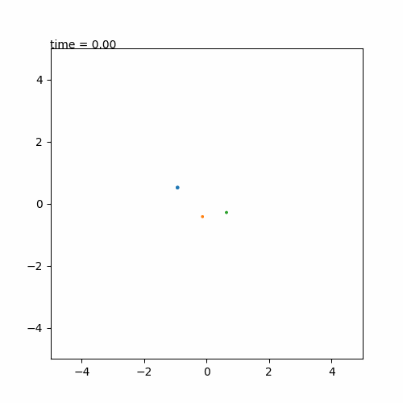
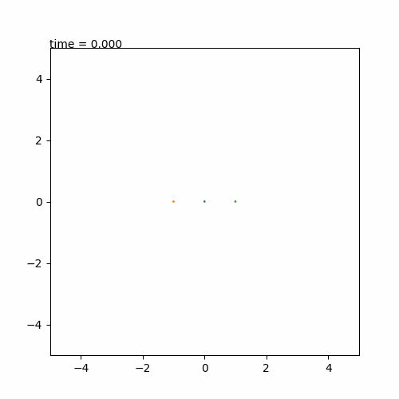

# N-Body Problem

|  |
|:--:|
| Figure 1: *Solution of inputs/pvi1.csv* |

## Creating Virtual Environments

To create the Python Virtual Environment from Command Prompt, Run: 
```sh Command Prompt 
python3 -m venv .venv
.venv\Scripts\activate.bat
pip install -r requirements.txt
```

To create the Python Virtual Environment from PowerShell, Run:
```powershell PowerShell
python3 -m venv .venv
.\.venv\Scripts\Activate.ps1
pip install -r requirements.txt
```

To create the Python Virtual Environment from Bash, Run:
```sh Bash
python3 -m venv .venv
source .venv/bin/activate
pip install -r requirements.txt
```
## Run Program

```sh
python .\n-body_problem.py file_csv 
```

### Exemple

```sh
python .\n-body_problem.py ipv
```

will execute [ivp.csv](ivp.csv) and generate [output/sol_ivp.csv](output/sol_ivp.csv) and [output/sol_ivp.gif](output/sol_ivp.gif).

|  |
|:--:|
| Figure 1: *Solution of ivp.csv* |